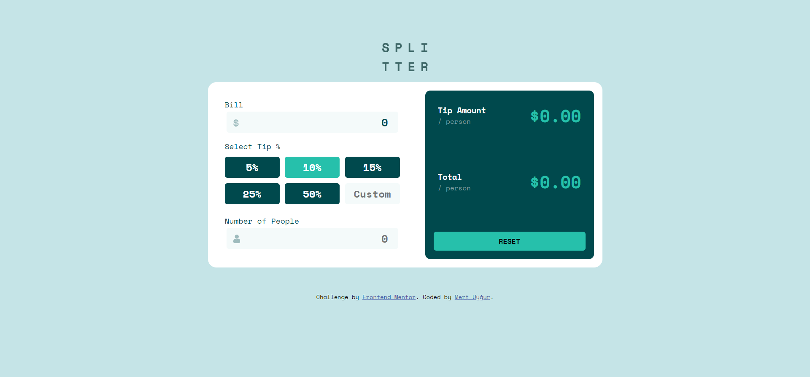

# Frontend Mentor - Tip calculator app solution

This is a solution to the [Tip calculator app challenge on Frontend Mentor](https://www.frontendmentor.io/challenges/tip-calculator-app-ugJNGbJUX). Frontend Mentor challenges help you improve your coding skills by building realistic projects.

## Table of contents

- [Overview](#overview)
  - [The challenge](#the-challenge)
  - [Screenshot](#screenshot)
  - [Links](#links)
- [My process](#my-process)
  - [Built with](#built-with)
  - [What I learned](#what-i-learned)
- [Author](#author)

## Overview

### The challenge

Users should be able to:

- View the optimal layout for the app depending on their device's screen size
- See hover states for all interactive elements on the page
- Calculate the correct tip and total cost of the bill per person

### Screenshot



### Links
- Solution URL: [https://www.frontendmentor.io/solutions/tip-calculator-app-with-vanilla-js-OuZrgk_9M](https://www.frontendmentor.io/solutions/tip-calculator-app-with-vanilla-js-OuZrgk_9M)
- Live Site URL: [https://fm-tip-calculator.vercel.app/](https://fm-tip-calculator.vercel.app/)

## My process

### Built with

- Semantic HTML5 markup
- CSS custom properties
- Flexbox
- CSS Grid
- Desktop-first workflow
- Vanilla JS

### What I learned

How to use grid and flex properties together to create beautiful layouts.

How to manipulate HTML inputs from Vanilla JS, event listeners and how to use function calls.

```javascript
    bill.addEventListener('change', () => {calculateTip(bill, currentTip)})
    nop.addEventListener('change', () => {calculateTip(bill, currentTip)})
    customTip.addEventListener('change', () => customTip.click())
```
I had a chance to use many event listeners and mix them together to get a working app.

Handling with errors. Span tags are the ones I use here. with innerHTML properties, I was able to manage these errors.
```javascript
    if(nop.value > 0){
        error.innerHTML = ""
        nop.style.border = '3px solid var(--strong-cyan)'
      }
      else if(nop.value.type == undefined){
        error.innerHTML = "Can't be zero";
        nop.style.borderColor = "red";
      }else {
        error.innerHTML = ""
      }
```

The input group down below was the most I was afraid of. Handling these values from Javascript was easier than I thought.
```html
<div class="inputs-tip-tip" id="tip">
  <input class="tippie" id="five" type="button" value="5%"></input>
  <input class="tippie active" id="ten" type="button" value="10%"></input>
  <input class="tippie" id="fifteen" type="button" value="15%"></input>
  <input class="tippie" id="twentyfive" type="button" value="25%"></input>
  <input class="tippie" id="fifty" type="button" value="50%"></input>
  <input class="tippie" id="custom" type="number" placeholder="Custom"></input>
</div>
```

With a simple for loop, I assign them click events, then managed to get outputs.
```javascript
    for (let i = 0; i < tipButtons.length; i++) {
      tipButtons[i].addEventListener("click", function() {
        const tip = this.value.split('');
        if(tip.slice(-1) == "%"){
          tip.pop()
        }
        currentTip = tip.join('');
        let current = document.querySelector(".active");
        current.classList.remove("active");
        this.classList.add('active');
        if(this.id === "custom"){
          currentTip = this.value
        }
        calculateTip(bill, currentTip);
      });
    }
```

### Continued development

Because I am not focusing on Vanilla JS in real life projects, I am tend to forget It. I am planning to make more projects with Vanilla JS in order to stay comfortable with that.

## Author

- Website - [Mert Uyğur](https://merd.dev/)
- Frontend Mentor - [Mert18](https://www.frontendmentor.io/profile/yourusername)